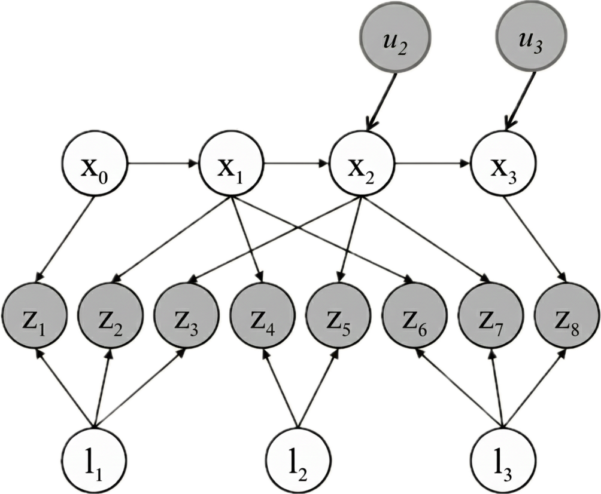

# SLAM Project

Authors: Jaydan Aladro, Arielle Gazzé, Dalil Merad

## Objective

The objective of this project was to learn how to implement a simple SLAM from scratch and run it on the robot in real life.

## Project

### Research

The main goal of SLAM is constructing and updating a map of an unknown environment while simultaneously keeping track of the robot’s location within it.

* **Mapping**: Given a robot’s location, we need to construct a representation of the world around it.
* **Localization**: Given a map of the robot’s world, we need to determine where the robot is.
* **But**: Localization assumes a map of the world to be available and mapping assumes the localization problem to be solved.

What has been done before?

### EKF SLAM

#### Theory

Predict step:
$$\begin{align*}
&\bar{\mu}_t = f(\mu_{t-1}, u_t, 0) \\
&\bar{\Sigma}_t = F_t \Sigma_{t-1} F_t^T + W_t Q_t W_t^T
\end{align*}$$

Update step:
$$\begin{align*}
&\mu_t = \bar{\mu_t} + K_t(z_t - h(\bar{\mu}_t, 0)) \\
&\Sigma_t = (I - K_t H_t) \bar{\Sigma}_t \\
&K_t = \bar{\Sigma}_t H_t^T (H_t \bar{\Sigma}_t H_t^T + V_t R_t V_t^T)^{-1}
\end{align*}$$

#### Implementation

#### Results

### MAP SLAM

#### Theory

$$\underset{X, L}{\mathrm{argmax}} P(X, L | Z, U) = \underset{X, L}{\mathrm{argmin}} \left( \sum_{i=1}^{M} \lVert f(\mathcal{x}_{i-1}, \mathcal{u}_i) - \mathcal{x}_i \rVert^2 + \sum_{k=1}^{K} \lVert h(\mathcal{x}_{i}, \mathcal{l}_{k \to j}) - \mathcal{z}_k \rVert^2 \right)$$

$$\begin{align*}
&X \text{: M robot poses} \\
&L \text{: K landmarks} \\
&Z \text{: observation of landmarks} \\
&L \text{: controls} \\
&f \text{: motion model} \\
&h \text{: measurement model} \\
\end{align*}$$

#### Implementation

#### Results

### Challenges

#### Groundtruth

The groundtruth pose of the robot was not available to compare to our SLAM estimate. We decided to use the real road observations to estimate the results of our algorithms.

#### Heavyness of MAP

By the time the optimizer finished, the robot had already moved, rendering the correction outdated. Latency caused linearization errors that even manually stopping the robot could not fix due to poor initialization.

#### Apriltags

The use of image features is very heavy for use on the real duckiebot. We opted for the use of apriltags for feature SLAM to resolve this issue.